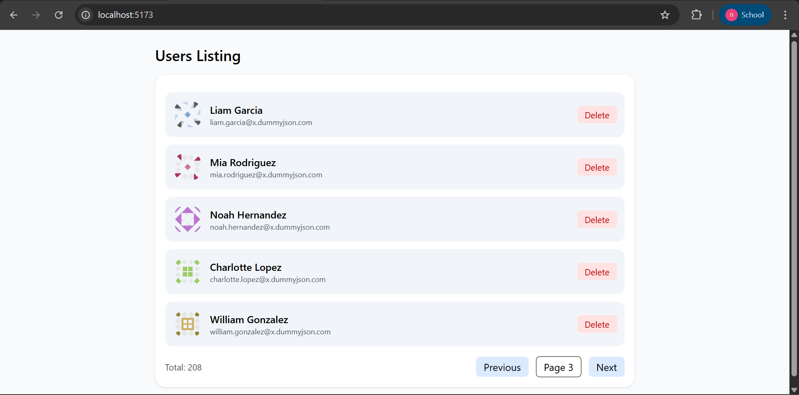

# Users List React App

A simple React application that fetches users from the **DummyJSON API**, displays them in a clean UI, and supports **pagination** and **delete** functionality.

---

## Features

* Fetch users with pagination (5 users per page)
* Delete a user from the list (local state only)
* Loading and error handling
* Modern UI with Tailwind CSS

---

## Screenshot




---

## Installation

```bash
npm install
```

---

## Run the Project

```bash
npm run dev
```

---

## Tech Stack

* **React** (Hooks)
* **Tailwind CSS**
* **DummyJSON API** for sample user data

---

##  Project Structure

```
src/
 └── App.jsx         # Root component
 └── main.jsx        # Entry file
```

---

## API Used

[https://dummyjson.com/users](https://dummyjson.com/users)

---

## How It Works

1. The component fetches users based on the current page.
2. Each page shows **5 users**.
3. Users can be deleted locally using a simple filter.
4. Pagination buttons allow navigating through pages.

---
